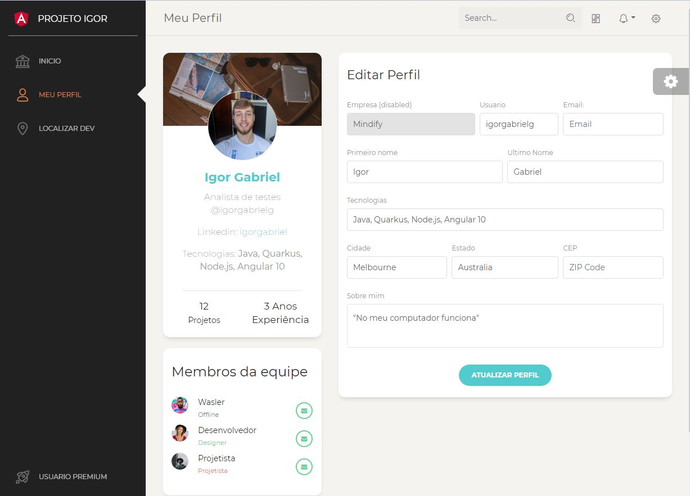

<h4 align="center"> 
	I'm A Dev
</h4>
<p align="center">
  <a>
  
  </a>
  
  <a>
  
  </a>
  
  <a href="https://www.linkedin.com/in/igorgabrielg/">
    
  </a>

  <a href="https://github.com/igorgabrielg/im-a-dev/commits/master">
    
  </a>

  <a>
  
  </a>
</p>
<p align="center">
  <a href="#project">Projeto</a>&nbsp;&nbsp;&nbsp;|&nbsp;&nbsp;&nbsp;
  <a href="#-layout">Layout</a>&nbsp;&nbsp;&nbsp;|&nbsp;&nbsp;&nbsp;
  <a href="#rocket-Tecnologias">Tecnologias</a>&nbsp;&nbsp;&nbsp;|&nbsp;&nbsp;&nbsp;
  <a href="#compilar">Compilar</a>&nbsp;&nbsp;&nbsp;|&nbsp;&nbsp;&nbsp;
  <a href="#-como-contribuir">Como contribuir</a>&nbsp;&nbsp;&nbsp;|&nbsp;&nbsp;&nbsp;
  <a href="#memo-licensa">Licensa</a>
</p>

<br>

## Project

Este projeto foi desenvolvido para criar uma UI em Angular componentizada.

## 🔖 Layout

**Web**


<br>

## :rocket: Tecnologias

Esse projeto foi desenvolvido com as seguintes tecnologias:

- [Angular](https://angular.io/docs)
- [Bootstrap](https://getbootstrap.com/docs/3.3/) 
- [Ng Bootstrap](https://ng-bootstrap.github.io/#/home)

## Compilar

* Instalar dependencias
```
npm install
```
* Compila o projeto
```
ng serve
```

## 🤔 Como contribuir

- Faça um fork desse repositório;
- Cria uma branch com a sua feature: `git checkout -b minha-feature`;
- Faça commit das suas alterações: `git commit -m 'feat: Minha nova feature'`;
- Faça push para a sua branch: `git push origin minha-feature`.

Depois que o merge da sua pull request for feito, você pode deletar a sua branch.

## :memo: Licensa

Este projeto está sob a licensa MIT. Veja o [LICENSE](LICENSE.md) para mais detalhes.

---

Desenvolvido por Igor Gabriel :wave: [Entrar em contato!](https://www.linkedin.com/in/igorgabrielg/)
